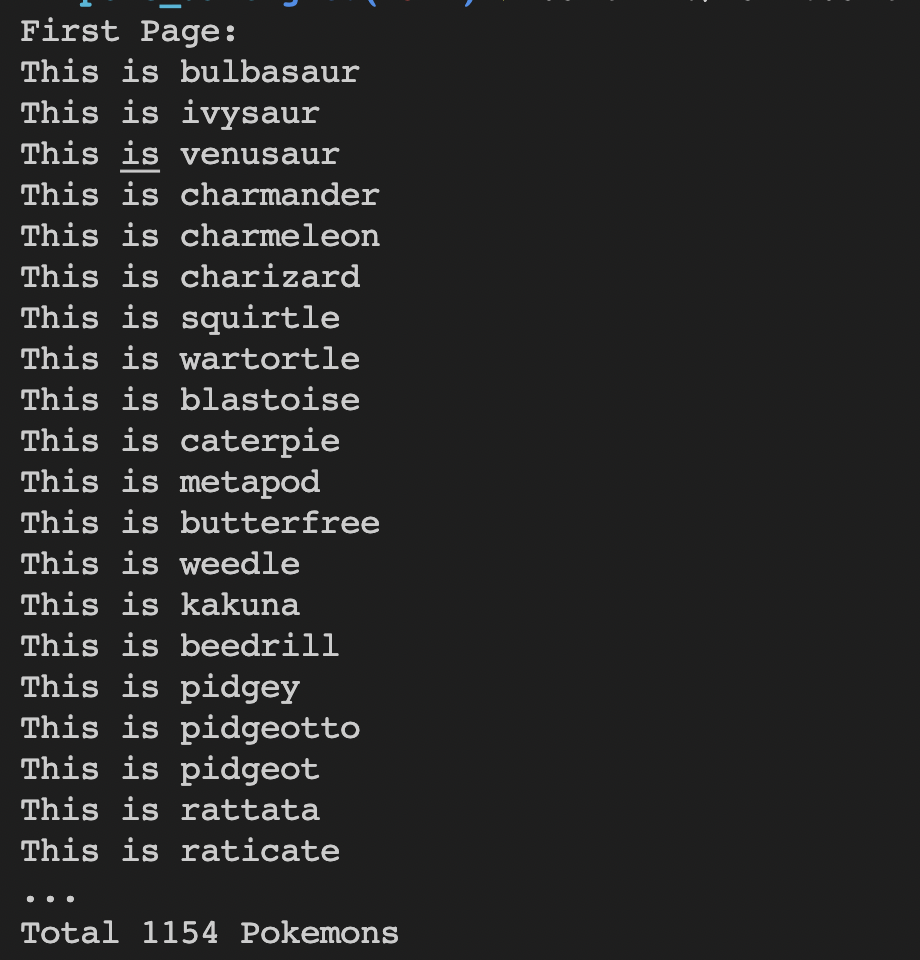

# Poke Dart

Created for [retrofit + mockito tutorial on medium](https://medium.com/flutter-tips/flutter-mocking-a-retrofit-client-8c2262e6ae6e).
This method is also applicable to flutter.

## How To Run

1. Run `flutter pub get`
2. Run `flutter pub run build_runner build`
3. Run `dart lib/main.dart`

The output should look like this:

## Tutorial

To move to the end state of the program, simply go to the [finished branch](https://github.com/margunwa123/poke_dart_retrofit_mockito/tree/finished)
